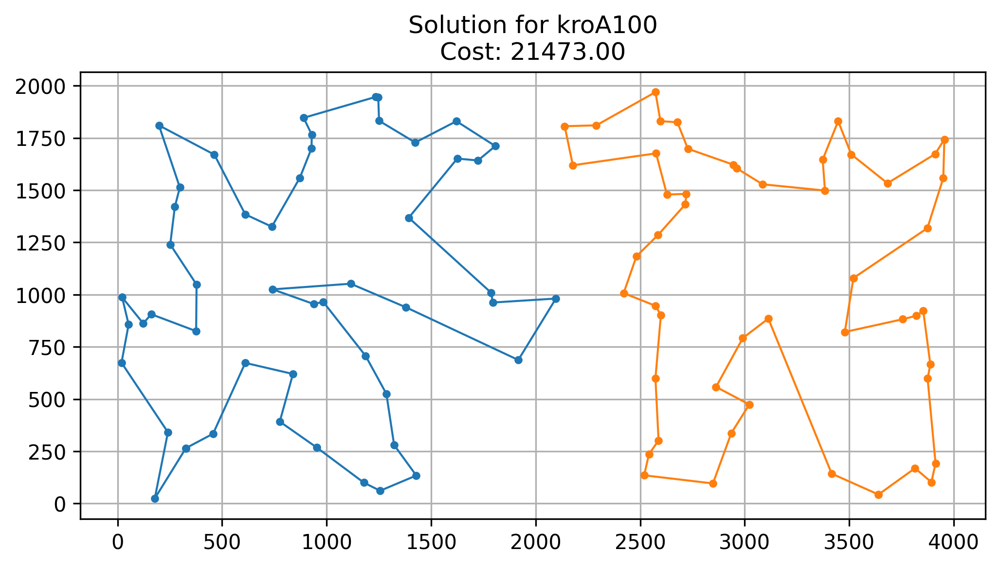

  

# 2-TSP solver

A comprehensive Python implementation of heuristic algorithms for the 2-cycle Traveling Salesman Problem (2-TSP), encompassing:
- constructive methods (greedy and regret-based cycle algorithms),
- local search heuristics (vertex and edge-based steepest descent, candidate moves, move-list strategies),
- advanced metaheuristics (Multi-Start Local Search, Iterated Local Search, Large Neighborhood Search),
- as well as a hybrid evolutionary algorithm with mutations.

Core features are verified using rudimentary pytest tests.
Simple solution visualization using matplotlib is also included.
#### Sample plot for kroA100 - HAE + LS

